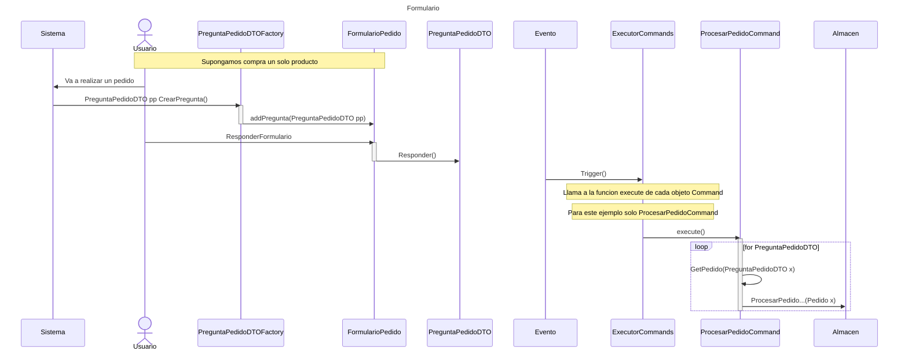
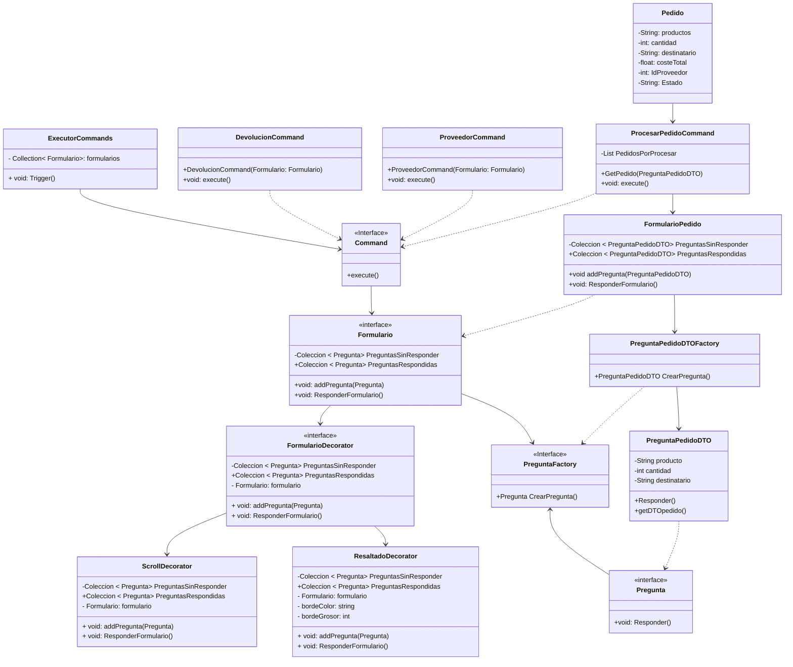

**Solución al Ejercicio: Distribuidora**

**(a) Aplicación del patrón Command:**
Para automatizar el procesamiento de formularios y permitir la incorporación de nuevos tipos en el futuro, se puede aplicar el patrón de diseño Command. El patrón Command permite encapsular una solicitud como un objeto, lo que permite parametrizar otros objetos con diferentes solicitudes, encolar o registrar solicitudes y admitir operaciones reversibles.
 A continuación, se muestra una descripción general de las clases involucradas en el patrón:

- La interfaz `Command` define el método `execute()`, que será implementado por todas las clases de comandos específicos.
- La interfaz `Formulario` define los métodos comunes para todos los formularios, los formularios son contenedores de preguntas.
- La interfaz `Pregunta` define una plantilla para todas las preguntas con sus respuestas. La 'pregunta' es un componente que servira de objeto receptor para cada comando. Este aportara la informacion necesaria para ejecutar el comando y sus respectivas consecuencias.

La clase `ExecutorCommands` es responsable de ejecutar los comandos. Recibe los formularios, identifica el tipo de formulario y crea la instancia correspondiente del comando. Luego, invoca el método `execute()` del comando, que realiza las acciones específicas asociadas con el tipo de formulario.

Las clases `DevolucionCommand` y `ProveedorCommand` `ProcesarPedidoCommand` son comandos específicos que implementan la interfaz `Command`. Estas clases son responsables de realizar las acciones específicas asociadas con el tipo de formulario. Por ejemplo, el `ProcesarPedidoCommand` es responsable de procesar el pedido a un almacen. La clase 'FormularioPedido' es un formulario especifico que implementa la interfaz 'Formulario'. Esta clase es responsable de almacenar las preguntas y respuestas del formulario.
La clase `PreguntaPedidoDTO` es una clase DTO que contiene la informacion necesaria para procesar el pedido y esta implementa la interfaz `Pregunta`. Cuando esta clase recibe la respuesta del usuario, es utilizada por la clase `ProcesarPedidoCommand` para crear el objeto `Pedido` y procesarlo.

La clase `PreguntaPedidoDTOFactory` es una clase Factory que crea objetos `PreguntaPedidoDTO` y los devuelve a la clase `FormularioPedido`. Esta clase es responsable de crear las preguntas y respuestas del formulario.

**(b) Diagrama de secuencia**
A continuación, se muestra el diagrama de secuencia para el procesamiento de un formulario de pedido.

 El diagrama de secuencia muestra la interacción entre los objetos en el proceso de procesamiento de un formulario de pedido. El usuario responde a las preguntas del formulario, y el formulario se envía al `ExecutorCommands` para su procesamiento. El `ExecutorCommands` identifica el tipo de formulario y crea la instancia correspondiente del comando. Luego, invoca el método `execute()` del comando, que realiza las acciones específicas asociadas con el tipo de formulario. En este caso, el `ProcesarPedidoCommand` es responsable de procesar el pedido a un almacen. La clase `PreguntaPedidoDTO` es una clase DTO que contiene la informacion necesaria para procesar el pedido y esta implementa la interfaz `Pregunta`. Cuando esta clase recibe la respuesta del usuario, es utilizada por la clase `ProcesarPedidoCommand` para crear el objeto `Pedido` y procesarlo.

**(c) Uso del patrón Decorator:**
Para mostrar los formularios en pantalla, con características adicionales como la barra de desplazamiento y el resaltado, se puede aplicar el patrón de diseño Decorator. El patrón Decorator permite agregar funcionalidades adicionales a un objeto sin modificar su estructura. En este caso, cada formulario sería el componente básico, y las características adicionales serían decoradores que se aplicarían según las necesidades.

El patrón Decorator se compone de las siguientes clases:

- La interfaz `FormularioDecorator` representa el componente básico del formulario y define los métodos comunes.
- La clase `ScrollDecorator` es un decorador que agrega la funcionalidad de la barra de desplazamiento al formulario.
- La clase `ResaltadoDecorator` es otro decorador que permite resaltar el formulario mediante un borde de un determinado color y grosor.

Estos decoradores se pueden aplicar a los formularios según sus necesidades. Por ejemplo, un formulario largo puede usar el `ScrollDecorator` para agregar una barra de desplazamiento, mientras que un formulario importante o urgente puede utilizar el `ResaltadoDecorator` para resaltarlo visualmente.

